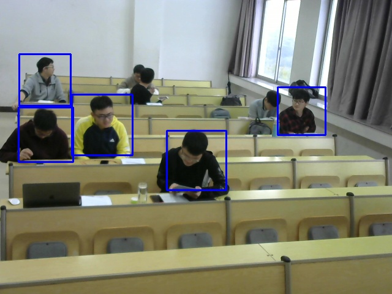
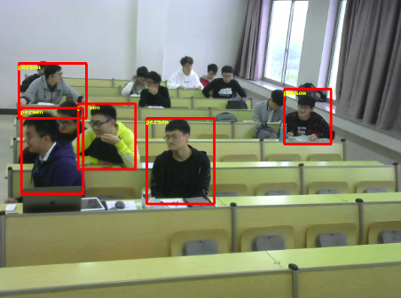
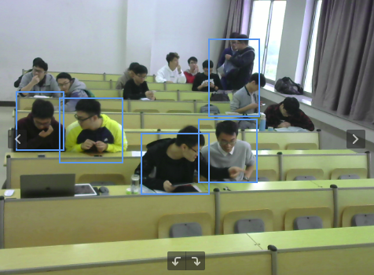

# People Detect in Classroom

##### Description

1. Real time people detect specifically in classroom environment.
2. With this system used in classroom, students will never skip classes! :-）
3. This is a demo just for fun which used opencv-haar only, so that it`s far from being a usable system and lots of work TODO, which means NEVER...
4. `getimg.cpp` get image or video with camera.
5. `video2img.cpp` split image from video.
6. `Box-select.cpp` select negative as well as positive samples.
7. `./data/data_classroomD9D405_2018.10.22_10:05 ` data base.
8. `./data/neg/` Negative sample set.
9. `./data/pos/` Positive sample set.
10. `./Baidu_Paddle_object_detection/` Baidu deeplearning API.

##### Usage:

Compile

```shell
chmod +x build.sh
./build&run.sh
```

Launch

```shell
cd bin

./getimg

./video2img [path_to_video -- Default ../data/video/video.mp4] [path_to_video -- Default ../data/video/frameoutput/] -k=0.8 -v=200
e.g. $ ./video2img  ../data/video/video.mp4 ../data/video/frameoutput/ -k=0.8 -v=200
```

Samples Creation

```shell
cd DATAset/data/
ls ./neg/*.jpg > neg.txt

opencv_createsamples -info pos.txt -num 25 -w 50 -h 50 -vec pos.vec
```

Train

```shell
opencv_traincascade -data data -vec pos.vec -bg neg.txt -numPos 100 -numNeg 135 -numStages 17 -w 50 -h 50 
```

Predict

```shell
python2 finall_test.py
```

##### Result



We tested BaiduPaddlepaddle as well as Face++ API





##### Reference

- http://note.sonots.com/SciSoftware/haartraining.html#Tutorial